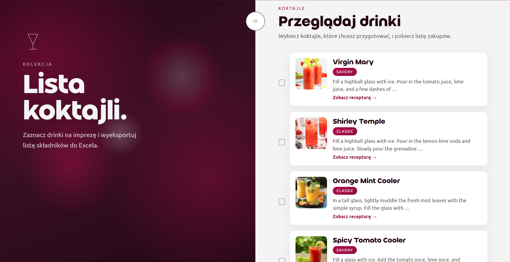
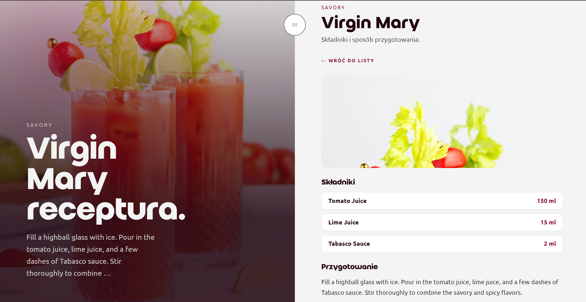
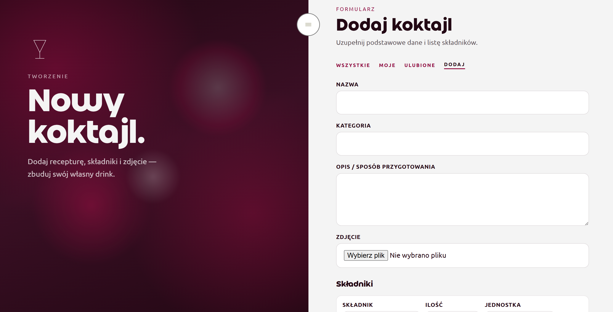
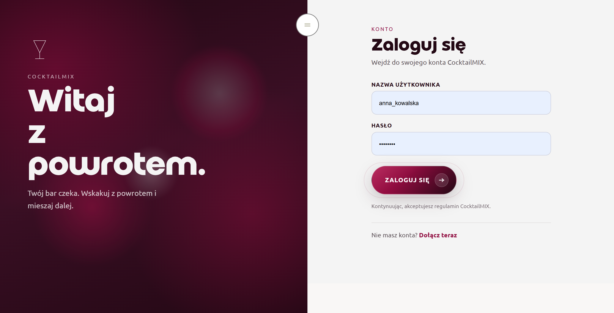
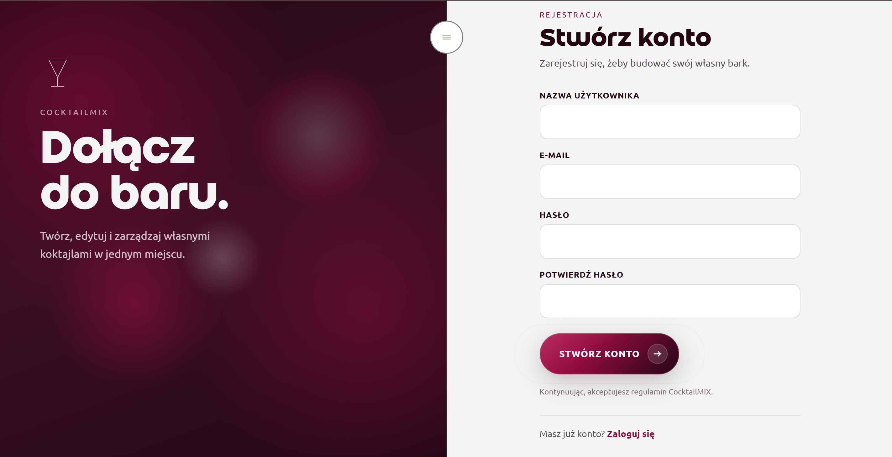

# 🍹 CocktailMix

Prosta aplikacja webowa do zarządzania przepisami na koktajle, stworzona w ramach zaliczenia przedmiotu języki skryptowe na Politechnice Wrocławskiej.

## 🚀 O projekcie
Aplikacja pozwala użytkownikom na przeglądanie przepisów oraz dla zalogowanych użytkowników na dodawanie nowych receptur, składników oraz edytację dodanych przez siebie koktajli. Projekt bazuje na frameworku Django.

## 🛠 Technologie
- **Backend:** Python, Django
- **Frontend:** HTML5, CSS3, JavaScript
- **Baza danych:** SQLite


## 📋 Funkcjonalności
- [ ] Przeglądanie listy wszystkich koktajli.
- [ ] System logowania i rejestracji użytkowników.
- [ ] Dodawanie koktajli do ulubionych.
- [ ] Panel administratora do zarządzania bazą przepisów.
- [ ] Dodawanie, edytowanie i usuwanie własnych receptur

## ⚙️ Instalacja i uruchomienie

1. **Sklonuj repozytorium:**
   ```bash
   git clone https://github.com/ixgvah/posturzynska-nowinski-projekt-koncowy.git
   cd posturzynska-nowinski-projekt-koncowy

2. **Stwórz i aktywuj środowisko wirtualne**
    ```bash
    python -m venv .venv
    # Windows:
    .venv\Scripts\activate
    # Linux/macOS:
    source .venv/bin/activate

3. Zainstaluj zależności
    ```bash
    pip install -r requirements.txt

4. **Wykonaj migrację bazy danych**
    ```bash
    python manage.py migrate

5. **Załaduj dane testowe (koktajle i użytkownicy):**
    ```bash
    python manage.py loaddata test_users.json
    python manage.py loaddata initial_data.json

6. **Uruchom serwer**
    ```bash
    python manage.py runserver

7. **Dane testowe**
    użytkownik: marcik_nowak
    hasło: Haslo123

    użytkownik: anna_kowalska
    hasło: Haslo123


## Struktura plików
- `/media` – zdjęcia koktajli
- `/static` – pliki statyczne (CSS, JS, ikony)
- `/cocktails` – główna aplikacja z logiką projektu
- `/initial_data.json` – baza z danymi testowymi
- `/test_users.json` – baza z użytkownikami testowymi
## 🖼️ Screenshots







## 👨‍💻 Autory
Iga Posturzyńska & Mikołaj Nowiński
